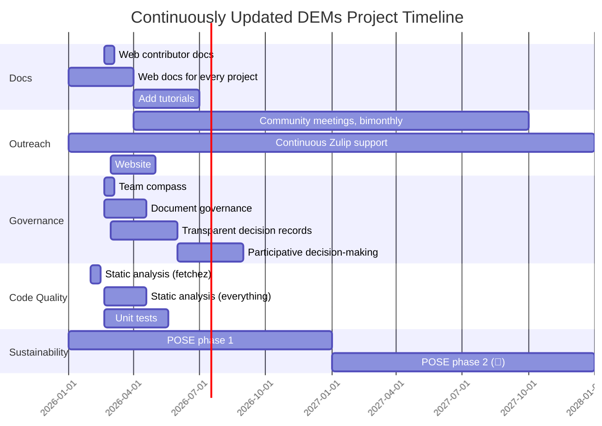

# 🗓️ Timeline

```mermaid
---
    # Frontmatter config, YAML comments
    config:
        themeCSS: |-
            rect[id^=workaround] { height: calc(100% - 50px) ; transform: translate(9px, 25px); y: 0; width: 1.5px; stroke: none; fill: red; }
            text[id^=workaround] { fill: red; y: 100%; font-size: 16px;}

            g.tick text {
              transform: rotate(-45deg);
              text-anchor: end !important; /* Aligns the end of the text to the tick mark */
            }
        gantt:
            useWidth: 650
            rightPadding: 0
            numberSectionStyles: 2
---
gantt
    title Continuously Updated DEMs Project Timeline
    dateFormat  YYYY-MM-DD

    section Docs
    Web contributor docs          : 2026-02-19, 2w
    Web docs for every project    : 2026-01-01, 3M
    Add tutorials                 : 2026-04-01, 3M

    section Outreach
    Community meetings, bimonthly : 2026-04-01, 18M
    Continuous Zulip support      : 2026-01-01, 2y
    Website                       : 2026-03-01, 2M

    section Governance
    Team compass                  : 2026-02-19, 2w
    Document governance           : 2026-02-19, 2M
    Transparent decision records  : 2026-03-01, 3M
    Participative decision-making : 2026-06-01, 3M

    section Code Quality
    Static analysis (fetchez)     : 2026-02-01, 2w
    Static analysis (everything)  : 2026-02-19, 2M
    Unit tests                    : 2026-02-19, 3M

    section Sustainability
    POSE phase 1                  : pose1, 2026-01-01, 1y
    POSE phase 2 (🙏)             : pose2, 2027-01-01, 1y
```
